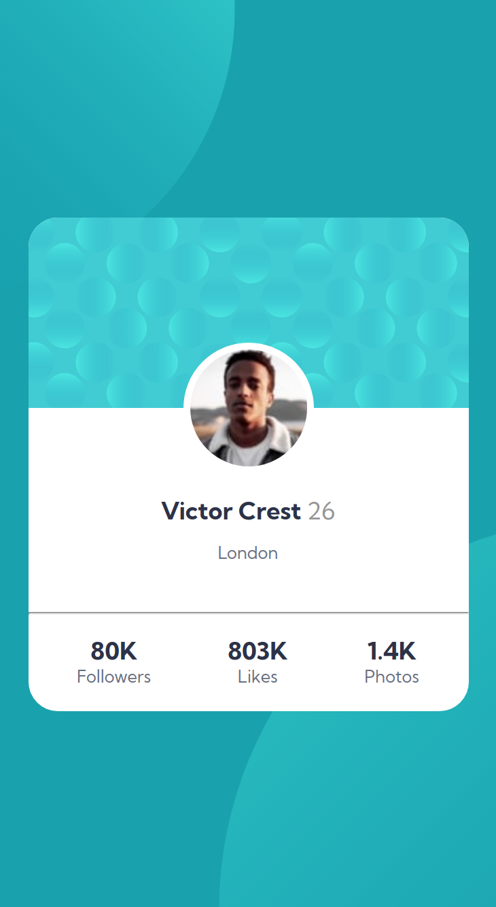

# Frontend Mentor - Profile card component solution

This is a solution to the [Profile card component challenge on Frontend Mentor](https://www.frontendmentor.io/challenges/profile-card-component-cfArpWshJ). Frontend Mentor challenges help you improve your coding skills by building realistic projects.

## Table of contents

- [Overview](#overview)
  - [The challenge](#the-challenge)
  - [Screenshot](#screenshot)
  - [Links](#links)
- [My process](#my-process)
  - [Built with](#built-with)
  - [What I learned](#what-i-learned)
- [Author](#author)
- [Acknowledgments](#acknowledgments)

## Overview

### The challenge

- Build out the project to the designs provided

### Screenshot

## Desktop

## Mobile

### Links

- Solution URL: [check on github](https://github.com/gauravnumber/profile-card-component-main)
- Live Site URL: [preview site](https://your-live-site-url.com)

## My process

### Built with

- Semantic HTML5 markup
- Flexbox
- Working on Desktop, Mobile
- [Sass](https://sass-lang.com/) - For styles

### What I learned

I learned how to use Google Chrome devtools for building frontend application.

## Author

- Github - [Gaurav](https://www.github.com/gauravnumber)
- Frontend Mentor - [@gauravnumber](https://www.frontendmentor.io/profile/gauravnumber)
- Twitter - [@gauravnumber](https://www.twitter.com/gauravnumber)

## Acknowledgments

For all fellow Frontend Mentor student.
